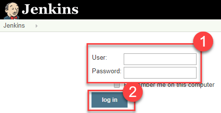
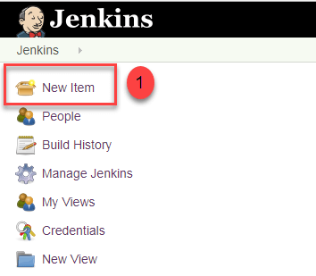

# Steps: For Manual installation

1. First forked the git repo into my repo with the following command

``` 
git clone https://github.com/MadumathiS/jgsu-spring-petclinic.git
```

2. Go to the directory jgsu-spring-petclinic

3. Then  enter the following command

```
./mvnw compile
```
4. Now we can see that a target file is generated 

5. Now we run tests with the following command and pacakage then we build the webpage at local host :8081

```
./mvnw test
./mvnw pacakage
java -Dserver.port=8081 -jar target/spring-petclinic-2.3.1.BUILD-SNAPSHOT.jar

```
6. The webpage is generated as :


## Jenkins Installation


Creating the first administrator user
Finally, after customizing Jenkins with plugins, Jenkins asks you to create your first administrator user.

When the Create First Admin User page appears, specify the details for your administrator user in the respective fields and click Save and Finish.

When the Jenkins is ready page appears, click Start using Jenkins.
Notes:

This page may indicate Jenkins is almost ready! instead and if so, click Restart.

If the page does not automatically refresh after a minute, use your web browser to refresh the page manually.

If required, log in to Jenkins with the credentials of the user you just created and you are ready to start using Jenkins!

- Step 1:
  
 Run the following command and generate the Jenkins installation in local host
```
 docker run -p 8080:8080 -v jenkins_home:/var/jenkins_home jenkins/jenkins:lts
 ```




- Step 2

Create New Item

Click on “New Item” at the top left-hand side of your dashboard.



- Step 3 Enter Item details

In the next screen,

Enter the name of the item you want to create.
Select Freestyle project
Click Okay


