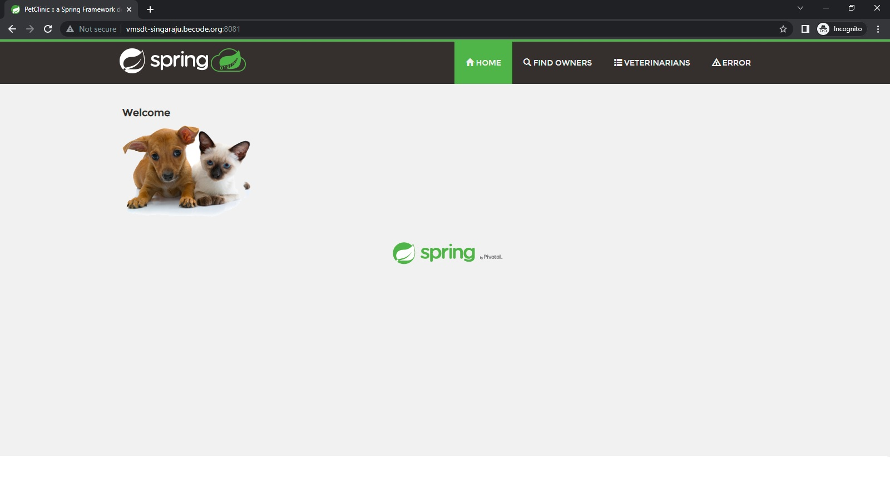
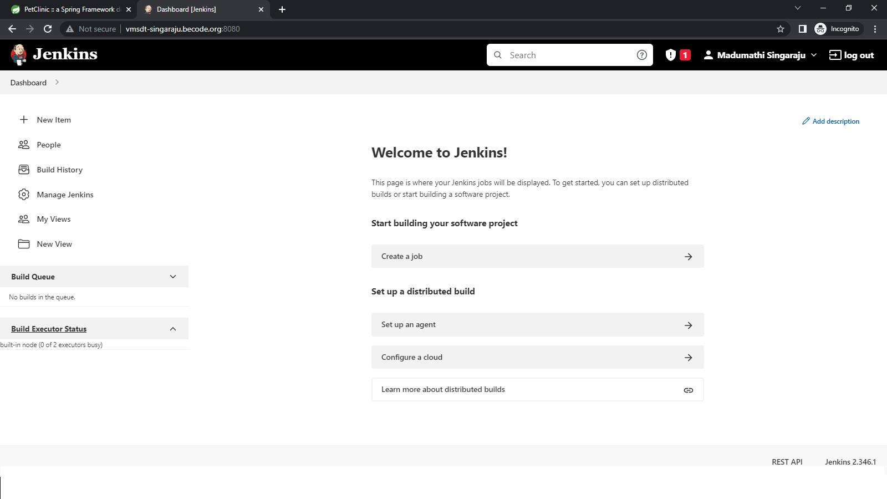

# Steps: For Manual installation

1. First forked the git repo into my repo with the following command

``` 
git clone https://github.com/MadumathiS/jgsu-spring-petclinic.git
```

2. Go to the directory jgsu-spring-petclinic

3. Then  enter the following command

```
./mvnw compile
```
4. Now we can see that a target file is generated 

5. Now we run tests with the following command and pacakage then we build the webpage at local host :8081

```
./mvnw test
./mvnw pacakage
java -Dserver.port=8081 -jar target/spring-petclinic-2.3.1.BUILD-SNAPSHOT.jar

```
6. The webpage is generated as :



## Jenkins Installation

 Run the following command and generate the Jenkins installation in local host
```
 docker run -p 8080:8080 -v jenkins_home:/var/jenkins_home jenkins/jenkins:lts
 ```


